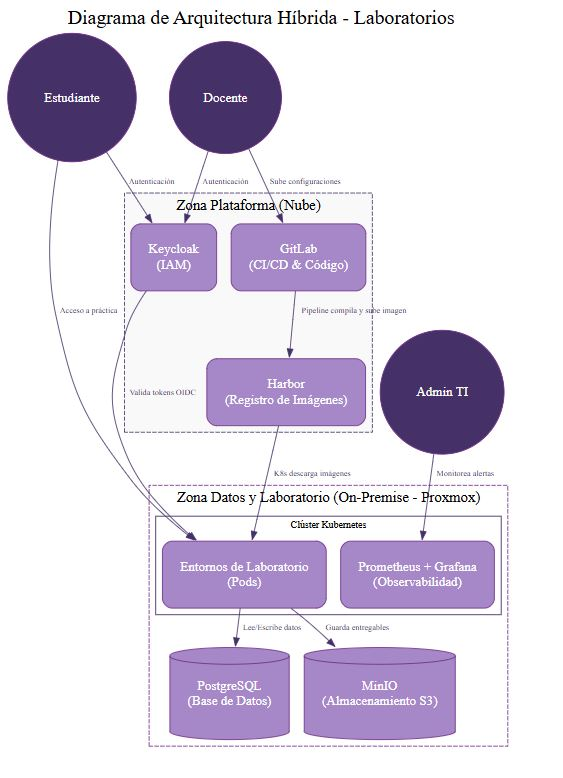
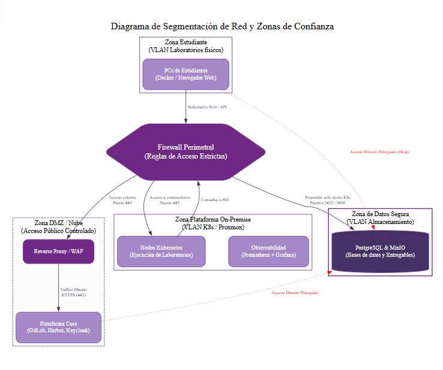

# Arquitectura Técnica Propuesta

## Modelo General
**Híbrido**: Local (On-Premise) + Nube

<!-- AÑADIDO (Auditoría OyM) -->
> **Qué se mejora respecto al documento original:** Se agrega una breve descripción sobre el propósito y beneficio directo del modelo híbrido para el laboratorio.
> **Justificación:** Se agrega el porqué del modelo, ya que el documento original solo lo declaraba sin explicar la decisión.

Este modelo permite aprovechar la infraestructura local del laboratorio (Proxmox VE) para las cargas recurrentes de clase, y reservar la nube para picos de demanda, continuidad de servicio y acceso remoto fuera del campus.

---

## Componentes Principales

- **GitLab** → Código fuente y CI/CD
- **Harbor** → Registro privado de imágenes de contenedores
- **Keycloak** → Gestión de identidad y acceso
- **Proxmox VE** → Virtualización de hardware
- **Kubernetes** → Orquestación de contenedores
- **PostgreSQL + MinIO** → Base de datos y almacenamiento

<!-- AÑADIDO (Auditoría OyM) -->
> **Qué se mejora respecto al documento original:** Se incluye la capa de observabilidad en el stack tecnológico propuesto.
> **Justificación:** Faltaban herramientas para monitoreo y alertas, imprescindibles para gestionar la plataforma proactivamente.

- **Prometheus + Grafana** → Observabilidad, métricas y alertas *(ver justificación extendida en la sección "Observabilidad")*

---

## Diagrama de Arquitectura

<!-- AÑADIDO (Auditoría OyM): sección completa nueva -->
> **Qué se mejora respecto al documento original:** Se añade la referencia visual de la arquitectura C4 (Nivel 1 y 2).
> **Justificación:** La auditoría señaló que el documento describe componentes pero no sus relaciones ni flujos de datos, y que no existe ningún diagrama de referencia.

---

## Segmentación de Red

<!-- AÑADIDO (Auditoría OyM): sección completa nueva -->
> **Qué se mejora respecto al documento original:** Se incluye una tabla de zonas de red y la referencia gráfica de la DMZ para definir reglas de seguridad perimetral.
> **Justificación:** Se identificó como riesgo la ausencia de segmentación de red y zonas DMZ entre el componente Nube y el On-Premise, relevante porque el laboratorio mezcla usuarios de distinto nivel de confianza (estudiantes practicando comandos administrativos vs. servicios de gestión).

| Zona | Componentes | Acceso |
|---|---|---|
| **Zona Estudiante** | Entornos de contenedores, red de laboratorio | Estudiantes y docentes, sin acceso directo a servicios de gestión |
| **Zona Plataforma** | GitLab, Harbor, Keycloak | Solo administradores y Chapter Leads técnicos |
| **Zona Datos** | PostgreSQL, MinIO | Solo servicios autorizados vía red interna, sin exposición directa |

---

## Alta Disponibilidad y Gestión de Capacidad

<!-- AÑADIDO (Auditoría OyM): sección completa nueva -->
> **Qué se mejora respecto al documento original:** Se detallan estrategias de clúster, cuotas de recursos y el manejo del "efecto campana" en aulas virtuales.
> **Justificación:** El documento original no definía el modelo de alta disponibilidad de Kubernetes ni consideraba el patrón de uso propio de un aula (todo un curso conectándose al mismo tiempo al inicio de clase), lo que representa un riesgo real de saturación no contemplado.

- **Kubernetes** operará en modo clúster (mínimo 3 nodos, control plane redundante), no en nodo único, para tolerar la caída de un nodo Proxmox durante una clase en curso.
- **Dimensionamiento por "efecto campana":** la arquitectura debe soportar el escenario de un aula completa (20-40 estudiantes) iniciando su entorno simultáneamente al comienzo de la clase, no un uso distribuido en el tiempo.
- **Cuotas de recursos (resource quotas)** por curso/carrera en Kubernetes, para evitar que un curso intensivo en cómputo (ej. Machine Learning) degrade el servicio de otros cursos corriendo en paralelo.
- **Proyección de capacidad:** se debe estimar y documentar cuántos usuarios y cursos concurrentes soporta la arquitectura actual, actualizando esta proyección cada semestre según el crecimiento de matrícula.

---

## Política de Respaldo y Recuperación ante Desastres (DRP/BCP)

<!-- AÑADIDO (Auditoría OyM): sección completa nueva -->
> **Qué se mejora respecto al documento original:** Se establecen reglas claras de backups (3-2-1), frecuencias y tiempos de recuperación objetivo (RTO/RPO).
> **Justificación:** La auditoría encontró ausencia total de políticas de respaldo para PostgreSQL, MinIO y Harbor, un riesgo alto considerando que ahí residen entregables y proyectos evaluables de los estudiantes.

- **Regla 3-2-1:** 3 copias de los datos, en 2 tipos de medio distintos, 1 de ellas fuera de sitio (nube).
- **Componentes con respaldo obligatorio:** PostgreSQL (bases de datos de cursos/proyectos) y MinIO (entregables y artefactos de estudiantes).
- **Frecuencia de respaldo:** diaria para PostgreSQL, incremental diaria / completa semanal para MinIO.
- **Prueba de restauración:** simulacro trimestral de recuperación, documentado y firmado por el Administrador de Laboratorio.
- **RTO/RPO objetivo:** RPO ≤ 24 horas, RTO ≤ 4 horas para servicios críticos (Harbor, PostgreSQL).
- **Plan de contingencia ante falla de nodo Proxmox durante una clase:** debe existir un entorno local de respaldo (ej. imágenes pre-cargadas en equipos físicos) para no interrumpir una sesión práctica en curso.

---

## Observabilidad

<!-- AÑADIDO (Auditoría OyM): sección completa nueva -->
> **Qué se mejora respecto al documento original:** Se añade el detalle de métricas, alertas y centralización de logs.
> **Justificación:** No existía monitoreo, logging centralizado ni alertas, lo que implicaba que una caída de servicio se detectaría solo cuando un docente la reportara en plena clase.

- **Monitoreo:** Prometheus para métricas de infraestructura (CPU, memoria, red) y de aplicación (tiempos de respuesta de Harbor/GitLab).
- **Visualización:** Grafana con dashboards por componente y por curso/carrera.
- **Alertas:** notificación automática al equipo de soporte ante caída de servicio, antes de que sea reportada por un docente en plena clase.
- **Logging centralizado:** agregación de logs de Kubernetes, Harbor y Keycloak para auditoría y diagnóstico de incidentes.

---

## Catálogo de Servicios (ITIL)

<!-- AÑADIDO (Auditoría OyM): sección completa nueva -->
> **Qué se mejora respecto al documento original:** Se crea una matriz con los servicios ofrecidos por la plataforma y sus respectivos tiempos de respuesta u objetivos.
> **Justificación:** Faltaba un catálogo de servicios (concepto ITIL) que le permitiera a un docente sin perfil técnico entender qué puede solicitar a la plataforma, sin necesidad de conocer los componentes de infraestructura.

| Servicio | Descripción | SLA objetivo |
|---|---|---|
| Aprovisionamiento de laboratorio virtual | Entorno de contenedores para un curso | ≤ 5 minutos por sesión |
| Solicitud de nueva imagen | Creación/aprobación de imagen de contenedor | Ver SLA en `gestion-imagenes.md` |
| Reserva de equipo físico | Asignación de hardware de laboratorio | ≤ 5 minutos |
| Soporte ante incidente | Atención de fallas reportadas | Según severidad (ver matriz de incidentes) |

---

## SLOs de Referencia

<!-- AÑADIDO (Auditoría OyM): sección completa nueva -->
> **Qué se mejora respecto al documento original:** Se definen métricas base de disponibilidad y recuperación esperada para medir el rendimiento de la arquitectura.
> **Justificación:** El documento no definía métricas de éxito ni SLOs/SLIs, dificultando evaluar objetivamente si la arquitectura cumple lo esperado.

- **Disponibilidad en horario lectivo:** ≥ 99%.
- **Recuperación ante fallo de nodo:** ≤ 15 minutos.
- **Tiempo de aprovisionamiento de entorno:** ≤ 5 minutos.

---

## Comentario del Integrante 1 — Revisión de `docs/arquitectura.md`

### ¿Qué está bien?

- La versión mejorada ya justifica el uso del modelo híbrido y explica la función de los componentes principales.
- Los diagramas permiten comprender mejor la relación entre la infraestructura local, la nube y las zonas de confianza.
- Se incorporan aspectos necesarios de segmentación, alta disponibilidad, capacidad, respaldos, recuperación, observabilidad y niveles de servicio.
- La consideración del “efecto campana” representa adecuadamente el uso simultáneo propio de una clase.

### ¿Qué está mal o puede mejorarse?

- La selección tecnológica todavía se presenta como decisión definitiva sin comparar alternativas, costos, licencias ni capacidades disponibles en la universidad.
- No se define un proveedor de nube, el tipo de enlace entre nube y campus ni la responsabilidad de operar cada componente.
- Algunos objetivos técnicos no indican cómo se medirán; por ejemplo, disponibilidad y recuperación requieren fuente de datos, periodo de medición y responsable.
- Se describen componentes y zonas, pero falta detallar el flujo completo de autenticación, publicación y descarga de una imagen.

### ¿Qué falta?

- Inventario y dimensionamiento inicial de CPU, memoria, almacenamiento, ancho de banda y número de usuarios concurrentes.
- Gestión de secretos, cifrado en tránsito y reposo, rotación de credenciales y registros de auditoría.
- Matriz de responsabilidades operativas y un procedimiento formal de gestión de cambios.
- Estimación de costos, dependencias externas y criterios para decidir qué carga se ejecuta localmente o en la nube.

### ¿Qué proponemos?

- Añadir una tabla de decisiones de arquitectura con alternativa evaluada, criterio, justificación, costo y responsable.
- Incorporar diagramas de secuencia para autenticación, solicitud/publicación de imágenes y recuperación ante fallos.
- Realizar una prueba de carga con usuarios concurrentes y usar sus resultados para dimensionar la infraestructura.
- Definir controles de seguridad y responsables tomando como referencia ISO/IEC 27001, DevSecOps y el principio de mínimo privilegio.

