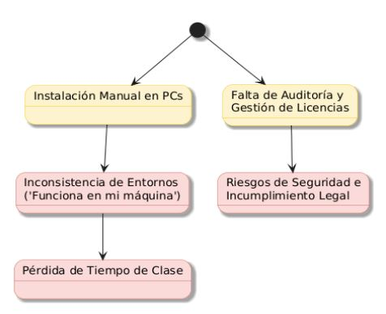
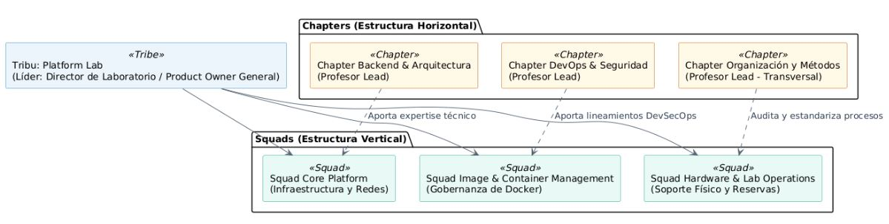
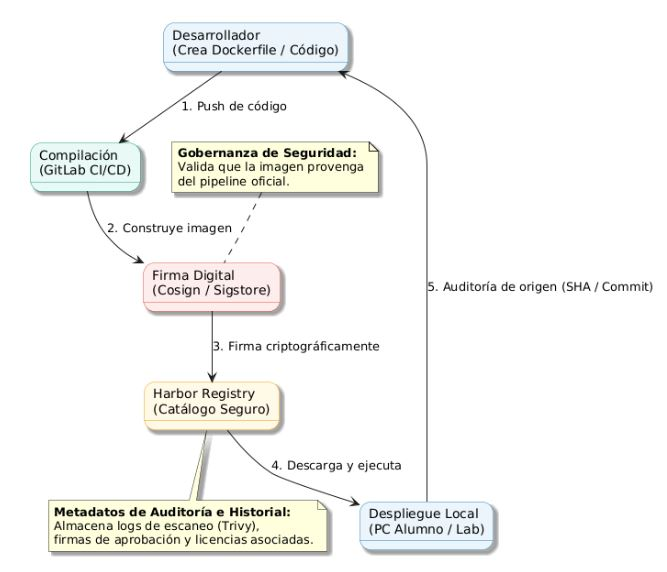

# Documento 2 — Propuesta de Organización

**Asignatura:** Organización y Métodos  
**Universidad:** Universidad Nacional de San Agustín de Arequipa  
**Equipo consultor:** Equipo A  
**Año:** 2026

> Documento colaborativo. Cada integrante incorporará las secciones correspondientes a su rol.

## 1. Introducción

**Responsable:** Paola Adamari Mayta Quispe — Scrum Master

La gestión eficiente de los laboratorios de computación constituye un elemento importante para el desarrollo de las actividades académicas, debido a que estos espacios concentran infraestructura tecnológica, aplicaciones, cuentas de usuario y entornos de trabajo utilizados por docentes y estudiantes. Sin embargo, cuando su administración se realiza mediante procedimientos manuales o poco estandarizados, pueden presentarse problemas como duplicidad de reservas, demora en la instalación de software, diferencias entre los entornos de trabajo y falta de trazabilidad sobre los recursos utilizados.

A partir de la revisión del repositorio «Plataforma Híbrida de Gestión de Laboratorios de Computación», el equipo consultor identificó fortalezas relacionadas con la estandarización de entornos, el uso de imágenes Docker y la integración de herramientas tecnológicas. También se encontraron oportunidades de mejora en la definición de responsabilidades, documentación de procesos, gestión de incidencias, control de licencias, seguridad y continuidad operativa.

Por esta razón, el presente documento propone una estructura organizacional para la gestión del laboratorio. La propuesta define actores, responsabilidades, mecanismos de comunicación y escalamiento, procesos organizacionales, indicadores de desempeño y lineamientos para la gobernanza de imágenes Docker, software y licencias.

El propósito es establecer un modelo de gestión ordenado, seguro, trazable y adaptable a las necesidades académicas, que permita aprovechar adecuadamente los recursos del laboratorio y facilite una futura evolución hacia un entorno empresarial.

## 2. Metodología de la consultoría

**Responsable:** Paola Adamari Mayta Quispe — Scrum Master

La consultoría se desarrolló mediante un enfoque de revisión documental y mejora de procesos. Como fuente principal se utilizó el repositorio proporcionado por el docente, compuesto por los archivos README, el backlog y la documentación ubicada en la carpeta `docs`.

El trabajo se inició con la distribución de los archivos entre los cuatro integrantes. Cada miembro evaluó los documentos asignados considerando cuatro preguntas: qué aspectos estaban correctamente desarrollados, qué elementos podían mejorarse, qué información faltaba y qué acciones se proponían.

Posteriormente, los hallazgos individuales fueron reunidos para elaborar un diagnóstico de la situación actual o AS-IS. Este diagnóstico sirvió como base para construir la propuesta de situación futura o TO-BE, conformada por una estructura organizacional, roles, matrices de responsabilidad, procesos, indicadores y mecanismos de gobernanza.

Finalmente, el equipo revisó la coherencia entre los problemas identificados y las soluciones propuestas. Las actividades fueron coordinadas mediante principios de Scrum y un tablero Kanban simplificado para controlar el avance y la revisión de los entregables.

### 2.1 Organización del equipo consultor

Para desarrollar la consultoría se asignaron roles que permitieron distribuir las responsabilidades de acuerdo con los componentes principales del trabajo.

| Integrante | Rol | Responsabilidad principal |
|---|---|---|
| Paola Adamari Mayta Quispe | Scrum Master | Coordinar las actividades, organizar el cronograma y el tablero Kanban, redactar la metodología, revisar la coherencia del documento y elaborar las recomendaciones y conclusiones finales. |
| Romina Giuliana Camargo Hilachoque | Product Owner | Elaborar el diagnóstico AS-IS, definir la propuesta TO-BE y comprobar que las mejoras respondan a las necesidades del laboratorio. |
| José León Enrique Hatches Curo | Analista BPMN | Diseñar y documentar los procesos, identificando actividades, responsables, entradas, salidas y decisiones. |
| José Manuel Morocco Saico | Analista Organizacional | Definir la estructura organizacional, los roles, la matriz RACI, los mecanismos de comunicación, el escalamiento, los indicadores y la gobernanza. |

Aunque cada integrante asumió una responsabilidad principal, la revisión final se realizó de manera conjunta para evitar contradicciones entre los procesos, roles y recomendaciones.

### 2.2 Metodología aplicada

La metodología se organizó en seis etapas:

#### Etapa 1: Revisión y levantamiento de información

Se revisaron los archivos del repositorio para comprender el propósito de la plataforma, sus objetivos, componentes técnicos, procesos y modelo organizacional.

#### Etapa 2: Auditoría documental

Cada integrante evaluó los archivos asignados empleando criterios relacionados con claridad, coherencia, viabilidad, trazabilidad, seguridad y gestión de procesos. Los resultados fueron registrados como comentarios dentro del repositorio y en el Informe de Revisión.

#### Etapa 3: Diagnóstico AS-IS

Los hallazgos fueron consolidados para describir la situación actual. Se identificaron problemas como falta de responsables claramente definidos, procesos incompletos, ausencia de indicadores, riesgos de seguridad y debilidades en el control del software y las licencias.

#### Etapa 4: Diseño de la propuesta TO-BE

Sobre la base del diagnóstico se definió una estructura organizacional mejorada, acompañada de roles, responsabilidades, matrices organizacionales y procesos BPMN.

#### Etapa 5: Validación y revisión

Se verificó que cada problema identificado tuviera una recomendación o mecanismo de solución. También se revisó la coherencia entre la matriz RACI, los procesos, los indicadores y la estructura organizacional.

#### Etapa 6: Consolidación de entregables

Finalmente, se integraron los aportes en dos productos: el Informe de Revisión y Comentarios y la Propuesta de Organización.

### 2.3 Cronograma y recursos de la consultoría

El trabajo documental se organizó en cuatro jornadas. Esta planificación representa el esfuerzo del equipo consultor y no el tiempo de implementación técnica de toda la plataforma.

| Actividad | Responsable principal | Duración | Esfuerzo estimado | Recurso requerido | Resultado |
|---|---|---:|---:|---|---|
| Revisión del repositorio | Todo el equipo | 1 día | 2 h por integrante | Repositorio y documentos base | Comprensión de la propuesta |
| Distribución de archivos | Scrum Master | 1 día | 1 h | Reunión de coordinación | Responsabilidades asignadas |
| Auditoría documental | Todos, según asignación | 2 días | 4 h por integrante | GitHub y criterios de revisión | Comentarios por archivo |
| Diagnóstico AS-IS | Product Owner | 1 día | 4 h | Hallazgos de la auditoría | Problemas identificados |
| Diseño de procesos | Analista BPMN | 2 días | 6 h | Herramienta de modelado | Procesos documentados |
| Diseño organizacional | Analista Organizacional | 2 días | 6 h | Matrices y documentación | Roles, matrices y gobierno |
| Revisión integral | Scrum Master y equipo | 1 día | 2 h por integrante | Documento consolidado | Corrección de inconsistencias |
| Consolidación y presentación | Todo el equipo | 1 día | 2 h por integrante | Word, Markdown y GitHub | Entregables finales |

El plan detallado para ejecutar la propuesta, incluyendo calendario académico, capacidad del equipo y costos, se desarrolla en la sección 10.

### 2.4 Tablero Kanban resumido

| Pendiente | En proceso | En revisión | Terminado |
|---|---|---|---|
| Ajustes derivados de la exposición | Validación final de formato | Coherencia entre procesos y RACI | Revisión del repositorio |
| Cotización institucional del piloto | Estimación detallada de recursos | Revisión ortográfica | Auditoría de archivos |
| Validación del roadmap |  |  | Diagnóstico AS-IS |
|  |  |  | Propuesta TO-BE |
|  |  |  | Procesos y matrices |

El Scrum Master actualiza el tablero después de cada reunión. Una actividad solo pasa a “Terminado” cuando cuenta con evidencia, responsable identificado y revisión de al menos otro integrante.
---

## 3. Diagnóstico organizacional (AS-IS)
**Responsable:** Romina Camargo Hilachoque — Product Owner

La gestión de los laboratorios de cómputo tradicionales en la institución presenta ineficiencias estructurales críticas bajo el enfoque de procesos de Organización y Métodos (O&M). Al evaluar el flujo de valor, se evidencia que el modelo tradicional es incompatible con la agilidad que exige nuestro calendario académico.

  

Para dimensionar el impacto de estos problemas en la realidad académica de la facultad, se ha elaborado la siguiente matriz de diagnóstico:

| Problema Identificado (AS-IS) | Descripción de la Deficiencia | Impacto Operativo y Académico |
| :--- | :--- | :--- |
| **Instalación Manual (Cuello de Botella)** | El equipo de soporte instala el software requerido máquina por máquina al inicio del ciclo. | Toma de 2 a 3 semanas. En un semestre de 16 semanas (agosto-diciembre), representa una pérdida de casi el 20% del tiempo lectivo. |
| **Inconsistencia de Entornos** | Falta de estandarización entre las computadoras del laboratorio y las PCs portátiles de los estudiantes. | Alta tasa de incidentes técnicos en clase ("Funciona en mi máquina") y pérdida de tiempo diagnosticando errores. |
| **Ausencia de SLAs Operativos** | Solicitudes de nuevo software mediante procesos burocráticos y manuales sin tiempos de respuesta definidos. | Los docentes pueden esperar semanas por una aplicación, retrasando o cancelando prácticas de laboratorio. |
| **Falta de Trazabilidad y Gobernanza** | Nulo control sobre versiones instaladas, procedencia del código y estado de las licencias de uso. | Riesgos legales por infracción de propiedad intelectual y exposición a brechas de seguridad informática. |
| **Subutilización de Hardware** | Reservas gestionadas por canales informales (correos o bases de datos desactualizadas). | Solapamiento de horarios, tiempos muertos entre clases y subutilización de la infraestructura instalada. |

---

## 4. Propuesta de estructura organizacional (TO-BE)
**Responsable:** Romina Camargo Hilachoque — Product Owner

Para resolver los cuellos de botella detectados en el AS-IS y garantizar que el proyecto mantenga continuidad entre los semestres académicos, se propone adoptar un **Modelo Organizacional Ágil (Spotify Adaptado)**. 

  

El equipo consultor ha definido que esta estructura no implica que los estudiantes actuales desarrollen la plataforma, sino que establece el marco de trabajo metodológico que deberá seguir el equipo técnico asignado para evitar el desorden. La propuesta se organiza de la siguiente manera:

| Nivel Estructural | Equipo / Rol | Misión Organizacional TO-BE |
| :--- | :--- | :--- |
| **Alineación Estratégica** | **Tribu: "Platform Lab"** | Liderada por el Director de Laboratorio (Product Owner General). Asegura la continuidad del proyecto entre semestres y alinea el trabajo técnico con los objetivos académicos. |
| **Ejecución (Vertical)** | **Squad Core Platform** | Asegura la estabilidad de la red, los servidores (Proxmox VE), el clúster de Kubernetes y el almacenamiento (MinIO). |
| **Ejecución (Vertical)** | **Squad Image & Container Mgt.** | Enfocado exclusivamente en construir, auditar, asegurar y firmar el catálogo de contenedores cumpliendo tiempos de entrega estrictos. |
| **Ejecución (Vertical)** | **Squad Hardware & Lab Ops.** | Gestiona el inventario físico, el control de accesos mediante códigos QR y el mantenimiento del hardware. |
| **Estandarización (Horizontal)** | **Chapters Técnicos** | Liderados por profesores con experiencia industrial. Garantizan la transferencia tecnológica y el uso de buenas prácticas de desarrollo. |
| **Auditoría (Transversal)** | **Chapter Organización y Métodos** | Asigna un Process Owner a cada squad para mapear flujos, auditar la Matriz RACI y simplificar la burocracia técnica. |

---

## 7. Procesos organizacionales
**Responsable:** León Hatches Curo - Analista BPMN

En esta sección, se documentan los principales procesos de gestión del laboratorio utilizando BPMN 2.0, definiendo sus actores, entradas, salidas, actividades y responsables.

### 7.1. Matriz General de Procesos

En esta tabla se resumen los 4 macroprocesos diseñados para el ciclo de vida operativo del laboratorio:

| Proceso Principal | Entradas (Inputs) | Salidas (Outputs) | Responsable (Owner) |
| :---: | :---: | :---: | :---: |
| Solicitud de imágenes para cursos | Formulario de solicitud del docente (requerimientos de software, versión y curso). | Imagen Docker oficial escaneada, aprobada y publicada en el catálogo; o notificación de rechazo. | Responsable de Imágenes |
| Reserva de laboratorios | Solicitud de asignación por horario (reserva digital en portal). | Reserva confirmada y validada físicamente (Check-in QR), o cancelación por inasistencia. | Administrador de Laboratorio |
| Gestión de incidencias | Reporte de fallo o ticket de soporte (hardware dañado, error de software o red). | Incidencia resuelta/cerrada o escalada a mantenimiento especializado. | Administrador / Soporte Técnico |
| Onboarding y Offboarding | Nómina de estudiantes matriculados (inicio de semestre) y calendario académico (fin de semestre). | Cuentas y accesos creados en la plataforma (Onboarding) y revocación de permisos (Offboarding). | Administrador de Laboratorio |

### 7.2. Actores de los Procesos

Para la correcta lectura de los diagramas BPMN posteriores, se han definido los siguientes actores institucionales y sistémicos que participarán en los distintos carriles (Lanes) de los flujos:

| Actor del Proceso | Tipo | Descripción y Participación en los Flujos |
| :---- | :---- | :---- |
| Docente (Product Owner) | Humano | Usuario solicitante. Detona el proceso 7.1 al solicitar requerimientos específicos para su curso y aprueba el uso de recursos tecnológicos. |
| Estudiante (Desarrollador) | Humano | Usuario final del laboratorio. Participa activamente en el proceso 7.2 realizando la reserva y el check-in, y consume las imágenes de contenedores. |
| Administrador de Laboratorio | Humano | Responsable de la operatividad física y digital. Gestiona la infraestructura, resuelve incidencias y controla el alta y baja de usuarios (Onboarding/Offboarding). |
| Responsable de Imágenes | Humano | Gestor técnico del catálogo de contenedores (Docker). Evalúa, construye y aprueba manualmente las imágenes que requieren personalización. |
| Sistema Automatizado (Plataforma) | Sistema | Conjunto de herramientas tecnológicas (Harbor, Keycloak, Trivy) encargado de ejecutar tareas automáticas (service tasks), como escaneo de vulnerabilidades, envío de correos y entrega directa de imágenes. |

## 7.3. Solicitud de imágenes para cursos (BPMN)

Se modela el proceso mediante el cual los docentes solicitan imágenes Docker para sus cursos, incluyendo el flujo de aprobación y publicación correspondiente.

### 7.3.1. Objetivo

Estandarizar y asegurar la provisión de entornos de software (imágenes de contenedores Docker) requeridos por los docentes, garantizando que todo recurso publicado en el catálogo del laboratorio esté libre de vulnerabilidades y cuente con la aprobación formal del responsable técnico.

### 7.3.2. Actores

Para este proceso se definen tres actores principales:

1. **Docente (Product Owner):** Usuario que detona el proceso al requerir una imagen específica para su curso.  
2. **Sistema Automatizado (Harbor / Trivy):** Plataforma tecnológica que ejecuta tareas de servicio (Service Tasks) como búsquedas automáticas y escaneos de seguridad.  
3. **Responsable de Imágenes:** Actor técnico encargado de evaluar, construir, aprobar y publicar las imágenes que no se resuelven de forma automática.

### 7.3.3. Diagrama

  

### 7.3.4. Tabla de Actividades

| Paso | Actor | Actividad (Etiqueta BPMN) | Descripción Detallada |
| :---: | :---: | ----- | ----- |
| 1 | Docente | Registrar solicitud de imagen | El docente ingresa al portal y completa el formulario especificando el software, versión y curso requerido. |
| 2 | Sistema Automatizado | Buscar imagen en repositorio | El sistema consulta automáticamente Harbor para verificar si la imagen solicitada ya existe en el catálogo. |
| 3 | Sistema Automatizado | ¿Existe y está actualizada? | Compuerta de decisión que evalúa el resultado de la búsqueda en la base de datos. |
| 4a | Sistema Automatizado | Entregar enlace de descarga | (Camino Sí) El sistema aprueba la solicitud instantáneamente y envía el acceso al docente. |
| 4b | Sistema Automatizado | Notificar requerimiento | (Camino No) El sistema genera un ticket automático dirigido al área técnica para su creación. |
| 5 | Responsable de Imágenes | Buscar imagen base oficial | El encargado revisa repositorios confiables (ej. Docker Hub) para encontrar una base segura. |
| 6 | Responsable de Imágenes | ¿Existe imagen oficial? | Compuerta de decisión para definir el método de construcción del contenedor. |
| 7a | Responsable de Imágenes | Importar imagen oficial | (Camino Sí) Se descarga la imagen base verificada para adaptarla al curso. |
| 7b | Responsable de Imágenes | Crear imagen personalizada | (Camino No) El responsable construye el contenedor desde cero escribiendo los comandos necesarios. |
| 8 | Sistema Automatizado | Ejecutar escaneo de seguridad | La herramienta Trivy analiza el contenedor en busca de vulnerabilidades antes de su publicación. |
| 9 | Sistema Automatizado | ¿Escaneo exitoso? | Compuerta de decisión de seguridad estricta para aprobar el pase a producción. |
| 10a | Sistema Automatizado | Notificar rechazo de seguridad | (Camino No) El proceso se aborta (Error) y se notifica al responsable para que parchee las vulnerabilidades. |
| 10b | Responsable de Imágenes | Aprobar y publicar imagen | (Camino Sí) El responsable firma digitalmente la imagen y la libera en el catálogo oficial de Harbor. |
| 11 | Docente | Descargar imagen local | El docente accede a la imagen aprobada, culminando el proceso de provisión. |

## 7.4. Reserva de laboratorios (BPMN)

Se modela el proceso de asignación y reserva de laboratorios para cursos, prácticas o proyectos, considerando disponibilidad, aprobaciones y uso de los recursos.

### 7.4.1. Objetivo

Gestionar de forma eficiente la asignación y el uso de los equipos físicos del laboratorio, integrando la reserva digital con la validación de asistencia presencial. Esto evita el acaparamiento de recursos, liberando automáticamente los equipos si el usuario no se presenta en el tiempo de tolerancia.

### 7.4.2. Actores

Para este proceso se definen dos actores principales:

1. **Estudiante (Usuario Final):** Quien busca disponibilidad, realiza la reserva digital y acude físicamente al laboratorio para el uso del equipo.  
2. **Sistema Automatizado (Plataforma):** Encargado de validar la disponibilidad, registrar el Check-in mediante Código QR y gestionar la liberación automática de los equipos (temporizador).

### 7.4.3. Diagrama

  

### 7.4.4. Tabla de Actividades

| Paso | Actor | Actividad (Etiqueta BPMN) | Descripción Detallada |
| :---: | :---: | ----- | ----- |
| 1 | Estudiante | Buscar equipo y horario | El estudiante ingresa al portal del laboratorio y selecciona el bloque horario en el que necesita trabajar. |
| 2 | Sistema Automatizado | Evaluar disponibilidad | El sistema cruza la solicitud del estudiante con la base de datos de reservas activas. |
| 3 | Sistema Automatizado | ¿Equipo disponible? | Compuerta de decisión que verifica si hay hardware libre en el horario solicitado. |
| 4a | Sistema Automatizado | Mostrar alternativas | (Camino No) El sistema sugiere otros horarios disponibles y el proceso finaliza sin reserva. |
| 4b | Sistema Automatizado | Confirmar reserva digital | (Camino Sí) Se registra la reserva y se bloquea el equipo temporalmente en el sistema. |
| 5 | Sistema Automatizado | Esperar Check-in (15 min) | Temporizador de tolerancia. El sistema espera a que el estudiante llegue físicamente al laboratorio. |
| 6 | Estudiante | Escanear Código QR | El estudiante escanea el QR pegado en el monitor del equipo para confirmar su asistencia física. |
| 7 | Sistema Automatizado | ¿Check-in exitoso? | Compuerta de decisión que evalúa si el estudiante validó su asistencia dentro de los 15 minutos de tolerancia. |
| 8a | Sistema Automatizado | Cancelar y liberar equipo | (Camino No) Si el tiempo expira sin Check-in, el sistema revoca la reserva, libera el equipo para otros y finaliza el proceso (No-show). |
| 8b | Sistema Automatizado | Desbloquear equipo | (Camino Sí) El sistema habilita el uso físico del computador. |
| 9 | Estudiante | Utilizar equipo | El estudiante desarrolla sus actividades académicas o proyectos durante el bloque reservado. |
| 10 | Estudiante | Registrar Check-out | Al finalizar, el estudiante cierra sesión o registra su salida en el portal. |
| 11 | Sistema Automatizado | Registrar fin de uso | El sistema marca el equipo como "Disponible" nuevamente, culminando el ciclo operativo. |

---

## 9. Gobernanza de Imágenes Docker, Software y Licencias
**Responsable:** Romina Camargo Hilachoque — Product Owner 

Como parte de la consultoría se identificó la necesidad de establecer una política formal de gobernanza para la administración de imágenes Docker, software y licencias.

### 9.1 ¿Qué es la gobernanza del software?
La gobernanza del software es el marco estructurado de directrices, políticas, procesos y controles organizacionales que regulan la adquisición, el desarrollo, el despliegue, el mantenimiento y el retiro de activos de software y contenedores dentro de una infraestructura tecnológica. Define con claridad los derechos de decisión, los roles y las responsabilidades, garantizando el cumplimiento técnico y legal del software utilizado.

### 9.2 ¿Por qué es necesaria?
En una plataforma híbrida de laboratorios basada en microservicios y contenedores, la gobernanza de TI es imprescindible para:
*   **Evitar la proliferación de contenedores no controlados (Registry Bloat):** Prevenir que se saturen los volúmenes de almacenamiento del registro privado (Harbor) con imágenes obsoletas, duplicadas o sin uso lectivo real.
*   **Garantizar la Seguridad del Entorno:** Asegurar que ninguna imagen contenga malware o dependencias con vulnerabilidades críticas conocidas que pongan en riesgo la red de la universidad o de la empresa cliente.
*   **Alineación de Cumplimiento Legal:** Mitigar riesgos de propiedad intelectual y demandas legales controlando estrictamente las licencias del software embebido en los contenedores.

### 9.3 y 9.4 Lineamientos de Gobernanza (Docker y Licencias)
Se establecen directrices obligatorias para regir el ciclo de vida de los contenedores y el control exhaustivo de la propiedad intelectual. Se resumen en la siguiente matriz de políticas:

| Categoría de Control | Política de Gobernanza Establecida | Impacto Operativo |
| :--- | :--- | :--- |
| **Imágenes Base Oficiales** | Solo se autoriza el uso de imágenes base limpias y optimizadas provistas en repositorios seguros de Harbor (ej. Debian o Alpine). | Estandariza el entorno (Golden Images). |
| **Seguridad (SAST)** | Ninguna imagen será distribuible si el escáner Trivy detecta vulnerabilidades Altas o Críticas sin mitigar. | Previene despliegues inseguros. |
| **Firma Criptográfica** | Los sistemas solo ejecutarán imágenes que posean una firma válida (Cosign/Sigstore) del Responsable de Imágenes. | Garantiza la autenticidad del código. |
| **Inmutabilidad** | Prohibido el uso de la etiqueta genérica `:latest`. Las imágenes deben tener versionado académico (ej. `ciclo-2026-B`) en repositorios inmutables. | Asegura que las prácticas no se rompan por actualizaciones sorpresa. |
| **Software Propietario** | Integración de un gestor de licencias concurrente (Key Server) en Kubernetes. | Limita las instancias activas según el contrato. |
| **Open Source (Copyleft)** | Licencias como GPL v3 o AGPL requieren auditoría previa y aprobación formal del Product Owner. | Evita el riesgo legal de contagio de código fuente propietario. |

### 9.5 Importancia de la trazabilidad
La trazabilidad permite auditar con precisión retrospectiva el origen, creador y estado de integridad de cualquier activo digital desplegado. En el ecosistema del laboratorio, esto significa conocer exactamente qué código fuente dio origen al contenedor, quién compiló la imagen, qué herramientas de terceros fueron añadidas y si se cuenta con los derechos de uso vigentes, facilitando análisis rápidos de causa raíz ante fallas de infraestructura o incidentes de seguridad.

  

Mediante el uso de etiquetas de metadatos integradas en los contenedores dentro de Harbor, es posible auditar de manera precisa los siguientes puntos:

* **Origen y autoría:** Quién construyó la imagen (identificando el GitLab runner ejecutor y el commit de origen en el repositorio).

* **Aprobación y confianza:** Quién validó y aprobó la publicación (verificable mediante la firma criptográfica del Responsable de Imágenes).

* **Estado de seguridad:** Qué vulnerabilidades específicas existían al momento exacto del despliegue en el catálogo.

* **Composición interna:** Qué dependencias, librerías y tipos de licencias de software componen la imagen.

* **Análisis de Causa Raíz:** Permite rastrear el origen del código causante de un incidente y parchar la imagen base de forma centralizada en minutos.

### 9.6 Beneficios para una empresa de software
El modelo diseñado para la universidad es escalable al sector corporativo, generando los siguientes beneficios:
*   **Reducción del Time-to-Market:** El aprovisionamiento de un entorno de desarrollo seguro pasa de tardar días a tomar solo unos minutos.
*   **Cumplimiento Normativo (Auditorías):** Facilita certificaciones internacionales de ciberseguridad (ISO/IEC 27001, SOC 2 y marcos COBIT).
*   **Eficiencia de Costos:** El uso de imágenes optimizadas y políticas automáticas de retención reducen los costos de almacenamiento en la nube.
*   **Mitigación de Riesgos:** Garantiza un entorno con cero multas por uso de software no licenciado y blinda frente a ataques a la cadena de suministro (Software Supply Chain Attacks).
## 10. Plan de implementación y viabilidad de recursos

**Responsable:** Paola Adamari Mayta Quispe — Scrum Master

Con base en la auditoría realizada en el Documento 1, se identificaron riesgos críticos para la viabilidad del proyecto original: duraciones que no se alinean con el calendario académico, cargas horarias insostenibles para los estudiantes y ausencia de una estimación de costos de infraestructura, red y contingencia.

Para convertir la propuesta organizacional en un proyecto ejecutable, el presente plan integra tres instrumentos: un roadmap vinculado al calendario académico, un cálculo de capacidad sostenible del equipo y una matriz referencial de inversión tecnológica. Estos instrumentos deberán revisarse al inicio de cada semestre con información real de matrícula, inventario, disponibilidad docente y cotizaciones.

### Principios de viabilidad

- No iniciar una fase sin aprobar los entregables y recursos de la fase anterior.
- Reutilizar infraestructura existente cuando cumpla los requisitos de capacidad y seguridad.
- Ajustar el alcance del sprint a la disponibilidad académica real de los estudiantes.
- Ejecutar primero un piloto controlado antes de comprometer un escalamiento institucional.
- Tratar los costos como estimaciones sujetas a inventario, cotización y aprobación institucional.

### 10.1 Roadmap de implementación académica

El roadmap corrige la equivalencia temporal del proyecto original y organiza el trabajo alrededor de un año lectivo estándar de dos semestres de 17 semanas. La validación del MVP durante el periodo intersemestral estará condicionada a la disponibilidad voluntaria o formalmente asignada del equipo.

| Fase | Nombre | Duración | Ancla académica | Hito de salida |
|---:|---|---:|---|---|
| 0 | Diagnóstico y diseño detallado | 4 semanas | Semanas 1–4 del semestre 1 | Arquitectura, alcance e inventario de hardware aprobados. |
| 1A | MVP académico: construcción | 12 semanas | Semanas 5–16 del semestre 1 | Plataforma desplegada con infraestructura base operativa. |
| 1B | MVP académico: validación | 4 semanas | Semana 17 e intersemestre | KPIs evaluados, documentación revisada y controles de seguridad ejecutados con Trivy. |
| 2 | Piloto controlado de 1 a 3 cursos | 8 semanas | Semanas 5–12 del semestre 2 | Sin interrupciones críticas no mitigadas y satisfacción de usuarios igual o superior al 85 %. |
| 3 | Evaluación y estabilización | 4 semanas | Semanas 13–16 del semestre 2 | Informe de cierre, costos reales y lecciones aprendidas aprobados. |
| 4 | Escalamiento institucional | 12 semanas o más | Semestre 3 en adelante | Aprobación formal para ampliar la plataforma a la facultad. |

Cada fase funciona como una puerta de decisión. Si no se cumple el hito de salida, el comité de gobierno deberá corregir el alcance, ampliar el plazo o suspender temporalmente el avance, en lugar de trasladar riesgos abiertos a la fase siguiente.

### 10.2 Planificación de capacidad y horas sostenibles

Para evitar sobrecarga y mantener un ritmo sostenible, se descarta la dedicación original de 25 horas semanales por estudiante. El Product Owner debe ajustar el sprint backlog a la capacidad disponible en cada periodo:

| Periodo académico | Capacidad por estudiante | Criterio de planificación |
|---|---:|---|
| Semana regular sin cruces críticos | 10–12 h/semana | Desarrollo, revisión y documentación. |
| Semana de entregas parciales | 6–8 h/semana | Reducir alcance y priorizar entregables obligatorios. |
| Semana de exámenes finales | 0–3 h/semana | Sprint mínimo dedicado únicamente a mantenimiento crítico. |
| Vacaciones intersemestrales | 15–20 h/semana | Solo con disponibilidad confirmada; validación intensiva y documentación. |

La capacidad comprometida del equipo se calculará al inicio de cada sprint:

> **Capacidad del sprint = integrantes disponibles × horas disponibles × factor de enfoque**

Se recomienda utilizar inicialmente un factor de enfoque de 0,70, reservando el 30 % restante para reuniones, aprendizaje, incidencias y tareas no previstas. Si la capacidad disminuye por exámenes u otras asignaturas, se reducirá el alcance antes de aumentar las horas de trabajo.

### 10.3 Matriz referencial de costos e inversión tecnológica

GitLab, Harbor, Kubernetes y Keycloak disponen de ediciones de código abierto, pero su operación requiere infraestructura, energía, almacenamiento, respaldo y personal. La siguiente matriz presenta rangos preliminares en soles; no reemplaza el inventario institucional ni las cotizaciones de proveedores.

| N.º | Categoría | Componentes o supuesto mínimo | Tipo | Presupuesto referencial |
|---:|---|---|---|---:|
| 1 | Servidor principal | Servidor físico para Proxmox VE, mínimo 32 GB RAM y 8 núcleos | CAPEX | S/ 8 000–15 000 |
| 2 | Nodos de alta disponibilidad | Servidores adicionales para Kubernetes; cantidad definida por la prueba de capacidad | CAPEX | S/ 5 000–10 000 por nodo |
| 3 | Almacenamiento persistente | SSD/NVMe para Harbor y MinIO, mínimo 4 TB brutos antes de redundancia | CAPEX | S/ 1 500–3 000 |
| 4 | Equipamiento de red | Switch administrable con VLAN para zonas de estudiantes, plataforma y datos | CAPEX | S/ 800–2 000 |
| 5 | Servicios de nube | Instancias para respaldo, contingencia o picos de demanda | OPEX | S/ 500–1 500 al mes |
| 6 | Continuidad operativa | Electricidad, UPS, mantenimiento y reposición programada | OPEX | S/ 200–500 al mes |
| 7 | Contingencia técnica | Repuestos e imprevistos sobre la inversión aprobada | Reserva | 15 % del subtotal CAPEX |
| 8 | Licencias de software | MATLAB, IDE comerciales u otras herramientas solicitadas por docentes | CAPEX/OPEX | Sujeto al inventario y convenios universitarios |

Los rangos no deben sumarse automáticamente: el escenario final depende de la infraestructura reutilizable, el número de nodos, los meses de servicio en nube y las licencias ya cubiertas por convenios institucionales.

### 10.4 Control de viabilidad y aprobación presupuestaria

Antes de autorizar una adquisición o avanzar hacia el escalamiento, el comité de gobierno deberá revisar como mínimo:

| Control | Evidencia requerida | Responsable | Aprobador |
|---|---|---|---|
| Inventario reutilizable | Relación de servidores, red, almacenamiento y licencias disponibles | Administrador de Plataforma | Encargado de Laboratorio |
| Dimensionamiento | Prueba de carga con usuarios concurrentes y consumo medido | Equipo técnico | Comité de Gobierno |
| Comparación económica | Al menos tres cotizaciones o precios públicos comparables | Encargado de Laboratorio | Dirección / Comité de TI |
| Costo total de propiedad | CAPEX, OPEX, mantenimiento, energía y renovación a tres años | Product Owner | Dirección / Comité de TI |
| Disponibilidad del equipo | Horas asignadas de docentes, estudiantes y soporte | Scrum Master | Product Owner |
| Resultado del piloto | KPIs, incidentes, satisfacción, costos reales y lecciones aprendidas | Equipo consultor | Comité de Gobierno |

Las estimaciones deberán actualizarse cuando una cotización tenga más de 90 días, cambie el alcance o la prueba de capacidad muestre una variación superior al 20 %. El escalamiento solo será viable si cuenta con presupuesto aprobado, personal operativo asignado y cumplimiento de los criterios de salida del piloto.

## 11. Recomendaciones de implementación

**Responsable:** Paola Adamari Mayta Quispe — Scrum Master

Se recomienda implementar la propuesta de manera progresiva, comenzando con un piloto controlado en un laboratorio y un número reducido de cursos. Antes de incorporar la plataforma, deberán aprobarse formalmente los roles, responsabilidades, presupuesto y procesos operativos.

Asimismo, se recomienda:

1. Designar un responsable institucional permanente que garantice la continuidad del proyecto entre distintos semestres.
2. Formalizar la matriz RACI y comunicarla a docentes, estudiantes, administradores y personal de soporte.
3. Implementar inicialmente los procesos prioritarios: solicitud de imágenes, reserva de laboratorios, gestión de incidencias y administración de usuarios.
4. Establecer acuerdos de nivel de servicio para solicitudes, incidentes y disponibilidad de la plataforma.
5. Crear una política de gobernanza de imágenes Docker, software y licencias.
6. Mantener un inventario actualizado de hardware, software, cuentas, imágenes y licencias.
7. Capacitar a docentes, estudiantes y personal técnico antes del inicio del piloto.
8. Aplicar controles de seguridad como acceso por roles, escaneo de vulnerabilidades, firma de imágenes y registro de auditoría.
9. Medir indicadores como disponibilidad, utilización del laboratorio, tiempo de atención, satisfacción de usuarios y cantidad de incidentes.
10. Realizar revisiones periódicas para actualizar los procesos, riesgos y documentos.
11. Implementar respaldos y pruebas de recuperación para garantizar la continuidad operativa.
12. Validar los costos mediante inventario y cotizaciones antes de comprometer adquisiciones.
13. Ampliar la plataforma a otros laboratorios únicamente después de verificar los resultados técnicos, económicos y organizacionales del piloto.

## 12. Conclusiones

**Responsable:** Paola Adamari Mayta Quispe — Scrum Master

La revisión permitió determinar que la propuesta original constituye una base tecnológica útil para modernizar la gestión de los laboratorios de computación. Sus principales fortalezas son la estandarización de entornos, la utilización de imágenes de contenedores, la trazabilidad del software y la posibilidad de integrar recursos locales y servicios en la nube.

Sin embargo, la tecnología por sí sola no garantiza una gestión eficiente. Para que la plataforma funcione correctamente es necesario complementarla con una estructura organizacional, responsables definidos, procesos formalizados, canales de comunicación, mecanismos de escalamiento e indicadores de desempeño.

La propuesta desarrollada responde a estas necesidades mediante la definición de una situación futura o TO-BE. Esta considera la participación del director, encargado del laboratorio, administrador de la plataforma, docentes, estudiantes y personal de soporte, con responsabilidades diferenciadas.

El roadmap propuesto reconoce que la disponibilidad de tiempo, personal e infraestructura es limitada. Por ello, plantea validar el inventario y el presupuesto antes de iniciar adquisiciones, ejecutar un piloto reducido y condicionar el escalamiento a resultados medibles.

Finalmente, se concluye que la implementación debe realizarse gradualmente, evaluando sus resultados antes de ampliar el alcance. La mejora continua, la capacitación, la seguridad y la gobernanza del software serán factores indispensables para asegurar la sostenibilidad de la plataforma.

---

## 5. Definición de Roles y Responsabilidades

**Responsable:** Jose Manuel Morocco Saico — Analista Organizacional

En coherencia con las brechas identificadas durante la auditoría (Documento 1), se propone una estructura de seis roles formales que resuelve las inconsistencias detectadas: la ausencia de una autoridad institucional de alto nivel (Director), la falta de un Encargado de Laboratorio como nivel intermedio de supervisión, y la ambigüedad del rol "Jefe de Laboratorio" que aparecía en el backlog sin definición formal. Cada rol se describe con su misión, responsabilidades, nivel de autoridad y limitaciones de actuación.

---

### 5.1 Director de Carrera / Comité de TI

**Misión:** Garantizar que la plataforma de gestión del laboratorio esté alineada con los objetivos académicos y estratégicos de la carrera, y que su operación cumpla con las normativas institucionales y legales vigentes.

**Responsabilidades:**
- Aprobar la inversión en infraestructura y las políticas institucionales de uso del laboratorio.
- Validar las políticas de protección de datos personales de los estudiantes.
- Autorizar la incorporación de nuevas tecnologías al stack del laboratorio.
- Presidir la Revisión Semestral del Sistema al cierre de cada período académico.
- Resolver conflictos de autoridad que no puedan ser gestionados en niveles inferiores.
- Aprobar o rechazar solicitudes de excepción a las políticas de software y licencias comerciales.

**Nivel de autoridad:** Máxima autoridad institucional. Sus decisiones no requieren aprobación superior dentro del proyecto.

**Limitaciones:** No interviene en la operación diaria del laboratorio ni en decisiones técnicas de implementación.

**Indicadores asociados:** Nivel de satisfacción docente con el laboratorio (encuesta semestral), porcentaje de cumplimiento del plan de inversión tecnológica.

---

### 5.2 Encargado de Laboratorio

**Misión:** Supervisar la operación diaria del laboratorio físico y digital, garantizar la disponibilidad de los recursos, y actuar como punto de contacto entre la Dirección institucional y los usuarios del laboratorio (docentes y estudiantes).

**Responsabilidades:**
- Supervisar el inventario físico del laboratorio (computadoras, servidores, periféricos).
- Gestionar el calendario de uso del laboratorio, asignando horarios a cursos y proyectos.
- Aprobar o rechazar solicitudes de reserva especiales que se salgan del proceso estándar.
- Coordinar con el Administrador de Plataforma la resolución de incidentes de alta prioridad (P1/P2).
- Gestionar el proceso de onboarding de nuevos usuarios al inicio de cada semestre.
- Coordinar el proceso de offboarding y cierre de semestre (desactivación de cuentas, depuración de datos).
- Aprobar la incorporación de nuevas imágenes Docker al catálogo cuando el proceso escala a este nivel.
- Generar reportes mensuales de uso del laboratorio para la Dirección.

**Nivel de autoridad:** Gestión operativa general. Responde ante el Director. Tiene autoridad sobre el Administrador de Plataforma y el Personal de Soporte TI.

**Limitaciones:** No puede aprobar cambios de política institucional ni comprometer presupuesto sin autorización del Director.

**Indicadores asociados:** Tasa de utilización del laboratorio (horas usadas / horas disponibles), tiempo promedio de resolución de reservas conflictivas, número de incidentes P1/P2 por mes.

---

### 5.3 Administrador de Plataforma

**Misión:** Mantener la operación técnica de la plataforma digital (Harbor, Keycloak, Kubernetes, GitLab, PostgreSQL, MinIO), garantizar la disponibilidad de los servicios, gestionar el catálogo de imágenes Docker y ejecutar los controles de seguridad definidos.

**Responsabilidades:**
- Administrar el catálogo de imágenes en Harbor: aprobar, publicar y retirar imágenes del catálogo.
- Gestionar las cuentas de usuario en Keycloak: provisioning, deprovisioning y control de roles (RBAC).
- Ejecutar el escaneo de vulnerabilidades con Trivy y la firma digital con Cosign para cada imagen nueva o actualizada.
- Monitorear la disponibilidad de la infraestructura (Kubernetes, bases de datos, almacenamiento).
- Gestionar los backups de PostgreSQL y MinIO según la política de respaldo definida.
- Atender incidentes técnicos de nivel P2 y P3 (los P1 se escalan al Encargado de Laboratorio).
- Ejecutar el proceso de Control de Cambios para modificaciones en el entorno de producción.
- Generar el reporte mensual de estado del catálogo (imágenes activas, en revisión, retiradas, con CVEs pendientes).
- Mantener actualizada la gestión de secretos (rotación de credenciales, administración de vault).

**Nivel de autoridad:** Gestión técnica de la plataforma. Responde ante el Encargado de Laboratorio. Supervisa al Personal de Soporte TI en temas técnicos.

**Limitaciones:** No puede aprobar cambios de política institucional ni publicar imágenes con CVE CRITICAL sin autorización del Encargado de Laboratorio.

**Indicadores asociados:** Uptime de Harbor (objetivo: ≥ 99.5%), tiempo promedio de aprobación de imagen (objetivo: ≤ 48 horas), número de vulnerabilidades críticas no resueltas en el catálogo (objetivo: 0).

---

### 5.4 Docentes / Product Owners de Curso

**Misión:** Definir los requerimientos de software para sus cursos, solicitar y validar las imágenes Docker necesarias para las actividades académicas, y coordinar con el Encargado de Laboratorio la asignación de horarios y recursos.

**Responsabilidades:**
- Solicitar las imágenes Docker requeridas para su curso al inicio de cada semestre, con un mínimo de tres semanas de anticipación.
- Validar que las imágenes proporcionadas corresponden a los requerimientos pedagógicos del curso.
- Reservar los horarios de laboratorio para sus clases y evaluaciones.
- Comunicar a los estudiantes cómo acceder y utilizar las imágenes oficiales del catálogo.
- Reportar al Encargado cualquier problema con las imágenes o recursos durante el semestre.
- Aprobar el uso de software adicional no incluido en las imágenes estándar, con justificación académica documentada.

**Nivel de autoridad:** Usuario privilegiado con capacidad de solicitud y validación. No tienen acceso a los paneles de administración de Harbor, Kubernetes ni Keycloak.

**Limitaciones:** No pueden instalar ni modificar software directamente en los equipos del laboratorio. Solo pueden solicitar, validar y reportar.

**Indicadores asociados:** Porcentaje de solicitudes de imagen realizadas con al menos tres semanas de anticipación, tasa de satisfacción con el catálogo de imágenes (encuesta semestral).

---

### 5.5 Alumnos / Desarrolladores

**Misión:** Utilizar los recursos del laboratorio —físicos y digitales— de forma responsable y dentro de los procesos establecidos, para el cumplimiento de sus actividades académicas.

**Responsabilidades:**
- Reservar equipos del laboratorio a través del portal, respetando los horarios disponibles y el tiempo máximo permitido.
- Descargar las imágenes oficiales del catálogo Harbor para usarlas en sus computadoras personales.
- Realizar check-in y check-out al inicio y fin de cada uso de los equipos del laboratorio.
- Reportar problemas técnicos (equipos dañados, imágenes con errores) al canal de soporte definido.
- Cumplir con la política de uso aceptable del laboratorio: no instalar software no autorizado, no compartir credenciales, no modificar configuraciones del sistema.

**Nivel de autoridad:** Usuario final. No tienen acceso a paneles de administración de ningún componente del sistema.

**Limitaciones:** No pueden crear ni modificar imágenes en el catálogo oficial. Solo pueden descargar imágenes previamente aprobadas. Tienen una cuota máxima de horas de reserva semanal.

**Indicadores asociados:** Tasa de uso de imágenes oficiales vs. imágenes propias (objetivo: ≥ 75%), tiempo promedio de configuración del entorno de trabajo (objetivo: ≤ 15 minutos).

---

### 5.6 Personal de Soporte TI

**Misión:** Apoyar al Administrador de Plataforma en las tareas operativas rutinarias: mantenimiento físico de equipos, soporte de primer nivel a usuarios, y ejecución de tareas técnicas no críticas bajo supervisión directa.

**Responsabilidades:**
- Atender solicitudes de soporte de primer nivel de estudiantes y docentes: problemas de conexión, dificultades con Docker/Podman en computadoras personales, problemas de inicio de sesión.
- Ejecutar el mantenimiento preventivo de los equipos físicos del laboratorio según el calendario establecido.
- Ejecutar backups manuales cuando el sistema automatizado falla.
- Registrar todas las incidencias atendidas en el sistema de ticketing.
- Escalar al Administrador de Plataforma los incidentes que superen su nivel de resolución (N1).

**Nivel de autoridad:** Soporte operativo de primer nivel. Responde ante el Administrador de Plataforma.

**Limitaciones:** No tiene acceso a Harbor ni a la configuración de Kubernetes. No puede aprobar imágenes ni modificar permisos de usuarios. No puede tomar decisiones de política técnica de forma autónoma.

**Indicadores asociados:** Tiempo promedio de atención de incidentes N1 (objetivo: ≤ 4 horas hábiles), porcentaje de incidentes resueltos sin escalar (objetivo: ≥ 70%).

---

## 6. Matrices Organizacionales

**Responsable:** Jose Manuel Morocco Saico — Analista Organizacional

Presentamos tres herramientas organizacionales clave que definen claramente las responsabilidades, los canales formales de comunicación y los mecanismos de coordinación entre todos los actores del laboratorio. Estas matrices son el resultado directo de las brechas identificadas en la auditoría del Documento 1, donde se determinó que el repositorio original carecía de matrices complementarias de comunicación y escalamiento, y que la Matriz RACI existente presentaba errores de asignación.

---

### 6.1 Matriz RACI

Esta matriz asigna responsabilidades indicando quién **ejecuta (R)**, quién **aprueba (A)**, quién **debe ser consultado (C)** y quién **únicamente debe ser informado (I)**. Se corrigió la versión original del repositorio desdoblando la fila "Solicitud y Aprobación de Imágenes" en dos filas independientes, e incorporando los roles técnicos (Chapter Leads, Encargado de Laboratorio) y los procesos críticos faltantes (Gestión de Incidentes, Onboarding/Offboarding, Auditoría, Control de Cambios).

**Leyenda:**

| Letra | Significado |
|:-----:|-------------|
| **R** | Responsible — quien ejecuta la actividad |
| **A** | Accountable — quien responde por el resultado (único por fila) |
| **C** | Consulted — quien es consultado antes de decidir |
| **I** | Informed — quien es informado tras la decisión o ejecución |

**Matriz RACI Propuesta (Versión Corregida):**

| Actividad | Director | Encargado Lab. | Admin. Plataforma | Chapter Leads Téc. | Docente | Alumno | Soporte TI |
|-----------|:--------:|:--------------:|:-----------------:|:------------------:|:-------:|:------:|:----------:|
| Definición de políticas de uso del lab. | A | R | C | C | C | I | I |
| Solicitud de imagen para curso | I | I | I | I | R | R | A |
| Aprobación de imagen Docker | I | A | R | C | C | I | I |
| Creación de imagen personalizada | I | A | R | C | C | I | I |
| Escaneo de vulnerabilidades (Trivy) | I | I | R/A | C | I | I | I |
| Firma digital de imagen (Cosign) | I | I | R/A | I | I | I | I |
| Reserva de equipos de laboratorio | I | A | I | I | C | R | I |
| Aprobación de reservas especiales | I | R/A | I | I | C | I | I |
| Actualización de imágenes (patch) | I | I | R/A | C | I | I | I |
| Actualización de imágenes (major) | I | A | R | C | C | I | I |
| Onboarding de usuarios (inicio semestre) | I | R/A | R | I | I | I | I |
| Offboarding de usuarios (cierre semestre) | I | R/A | R | I | I | I | I |
| Gestión de incidentes P1/P2 | I | A | R | C | I | I | C |
| Gestión de incidentes P3/P4 | I | I | C | I | I | I | R/A |
| Auditoría mensual del catálogo | I | A | R | C | I | I | I |
| Control de cambios en producción | I | A | R | C | I | I | I |
| Definición y mejora de procesos | C | A | C | C | C | I | C |
| Gestión de licencias de software | C | A | R | C | C | I | I |
| Revisión semestral del sistema | A | R | C | C | C | I | I |

---

### 6.2 Matriz de Comunicación

Definimos cómo se intercambia la información oficial entre los actores, especificando el medio de comunicación autorizado, la frecuencia de las interacciones y los responsables directos de cada emisión y recepción. Esta matriz resuelve la brecha detectada en la auditoría: el repositorio original no definía ningún canal ni frecuencia formal de comunicación entre sus actores.

| N.° | Información comunicada | Emisor | Receptor | Canal | Frecuencia | Responsable de emitir |
|:---:|------------------------|--------|----------|-------|:----------:|----------------------|
| 1 | Confirmación de reserva de equipo | Sistema (portal) | Alumno / Docente | Correo electrónico automático | Por cada reserva | Sistema |
| 2 | Recordatorio de reserva próxima | Sistema (portal) | Alumno / Docente | Correo electrónico automático | 15 minutos antes | Sistema |
| 3 | Notificación de imagen disponible en catálogo | Admin. de Plataforma / Sistema | Docente solicitante | Correo electrónico | Por evento (al publicar) | Admin. de Plataforma |
| 4 | Notificación de rechazo de imagen (con justificación) | Admin. de Plataforma | Docente solicitante | Correo electrónico | Por evento (al rechazar) | Admin. de Plataforma |
| 5 | Reporte mensual de estado del catálogo | Admin. de Plataforma | Encargado de Laboratorio | Correo + documento PDF | Mensual | Admin. de Plataforma |
| 6 | Reporte mensual de uso del laboratorio | Encargado de Laboratorio | Director de Carrera | Documento formal / reunión | Mensual | Encargado de Laboratorio |
| 7 | Notificación de incidente activo (P1/P2) | Personal de Soporte TI | Admin. de Plataforma + Encargado | Canal de mensajería (Teams/Slack) | Inmediata (por evento) | Personal de Soporte TI |
| 8 | Actualización de estado de incidente | Admin. de Plataforma | Usuarios afectados | Correo electrónico | Cada 1 hora mientras esté activo | Admin. de Plataforma |
| 9 | Cierre de incidente con causa raíz | Admin. de Plataforma | Encargado de Laboratorio | Documento Post-Incident Review | Dentro de 48 h tras el cierre | Admin. de Plataforma |
| 10 | Convocatoria de Revisión Semestral | Encargado de Laboratorio | Director, Docentes, Admin. | Correo electrónico + agenda | Una vez por semestre | Encargado de Laboratorio |
| 11 | Informe de Revisión Semestral | Encargado de Laboratorio | Director de Carrera | Documento formal | Una vez por semestre | Encargado de Laboratorio |
| 12 | Notificación de inicio de semestre (onboarding) | Encargado de Laboratorio | Alumnos y Docentes nuevos | Correo electrónico con instrucciones | Inicio de cada semestre | Encargado de Laboratorio |
| 13 | Alerta de imagen con CVE detectado post-publicación | Sistema (Trivy) / Admin. | Encargado de Laboratorio | Correo de alerta automática | Por evento (escaneo periódico) | Sistema / Admin. de Plataforma |
| 14 | Comunicado de mantenimiento programado | Admin. de Plataforma | Todos los usuarios | Portal + correo | Con 72 horas de anticipación | Admin. de Plataforma |
| 15 | Solicitud de imagen para nuevo semestre | Docente | Admin. de Plataforma | Formulario del portal | Al menos 3 semanas antes del inicio de clases | Docente |

---

### 6.3 Matriz de Escalamiento

La Matriz de Escalamiento define el procedimiento para escalar problemas o incidencias según su nivel de criticidad. Resuelve la brecha identificada en la auditoría: el repositorio original no definía qué actor recibe cada tipo de problema ni en qué tiempo máximo debe recibir atención.

#### Niveles de Escalamiento

| Nivel | Nombre | Descripción del nivel | Receptor | Tiempo máx. de respuesta |
|:-----:|--------|-----------------------|----------|:------------------------:|
| **N0** | Autoservicio | El usuario resuelve el problema consultando la guía de usuario o la sección de preguntas frecuentes del portal. No requiere intervención humana. | Portal de soporte / FAQ | Inmediato |
| **N1** | Soporte TI (primer nivel) | Problema técnico que el usuario no puede resolver por su cuenta: falla de conexión, problema con Docker en equipo personal, error de login. El Personal de Soporte TI atiende y resuelve. | Personal de Soporte TI | ≤ 4 horas hábiles |
| **N2** | Administrador de Plataforma (segundo nivel) | Problema que requiere acceso a sistemas, configuración de plataforma o diagnóstico técnico avanzado. El Personal de Soporte TI escala al Administrador cuando no puede resolver en N1. | Administrador de Plataforma | ≤ 1 hora hábil |
| **N3** | Encargado de Laboratorio (tercer nivel) | Incidente de alta prioridad con impacto en múltiples usuarios (P1/P2), decisión de política operativa o situación que requiere autorización institucional de nivel intermedio. | Encargado de Laboratorio | ≤ 15 minutos |
| **N4** | Director de Carrera / Comité TI (nivel institucional) | Impacto institucional grave, brecha de seguridad de datos personales, decisión estratégica que supera la autoridad del Encargado o situación con repercusión externa. | Director de Carrera | Inmediato (guardia activa) |

#### Condiciones de Escalamiento por Tipo de Incidente

| Tipo de incidente | Nivel inicial | Condición de escalamiento al siguiente nivel | Tiempo máx. antes de escalar |
|-------------------|:-------------:|----------------------------------------------|:-----------------------------:|
| Usuario no puede iniciar sesión (un solo usuario) | N1 | Si no se resuelve en 4 horas hábiles | 4 h |
| Harbor inaccesible para todos los usuarios | N2 | Escalar directamente a N3 si no hay resolución en 30 min | 30 min |
| Kubernetes caído durante clase en curso | N3 | Escalar a N4 si el impacto afecta a más de un curso simultáneamente | 15 min |
| CVE CRITICAL detectado en imagen publicada | N2 | Escalar a N3 para decisión de retirar imagen del catálogo | Inmediato |
| Imagen con software sin licencia detectada | N3 | Escalar a N4 si involucra software propietario con riesgo legal | Inmediato |
| Equipo físico dañado (un equipo) | N1 | Escalar a N2 si el daño afecta la clase en curso | 1 h |
| Fallo masivo de equipos del laboratorio | N3 | Escalar a N4 si afecta evaluaciones formales | 15 min |
| Brecha de seguridad / acceso no autorizado | N3 | Escalar a N4 de forma inmediata | Inmediato |
| Solicitud de excepción a política de licencias | N3 | Siempre requiere aprobación de N4 para software propietario | — |
| Conflicto de reserva entre docentes | N2 | Escalar a N3 si no se resuelve en 2 horas | 2 h |

---

*Secciones 5 y 6 elaboradas por Jose Manuel Morocco Saico — Analista Organizacional.*
*Las matrices son coherentes con los hallazgos del Informe de Revisión y Comentarios (Documento 1, sección 6).*

